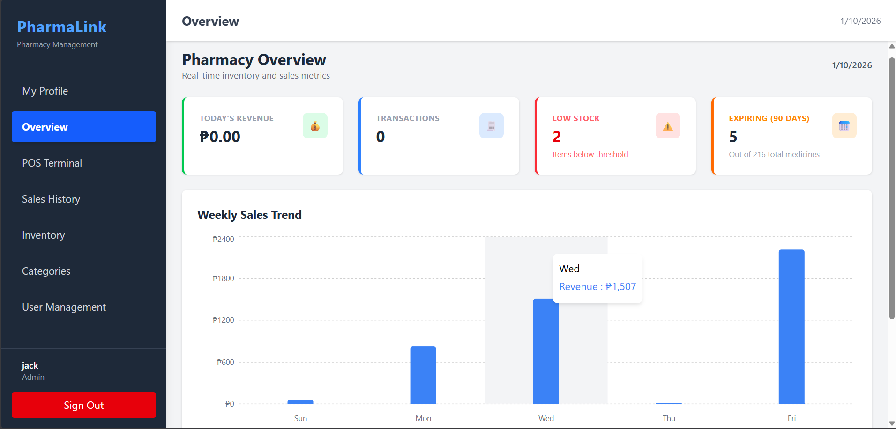

### **PharmaLink Web (Frontend)**

# PharmaLink

### Modern Pharmacy Management System (Frontend)

**PharmaLink Web** is the client-side application for the PharmaLink system. Built with **React 18** and **TypeScript**, it provides a responsive, role-based interface for managing pharmacy operations—from inventory tracking to point-of-sale transactions.




---

## Critical System Context

**This project is the Frontend only.**
It relies entirely on the **PharmaLink API** (Backend) to function. You **must** have the backend API running locally for this application to load data or authenticate users.

**Get the Backend Here:** **[PharmaLink API Repository](https://github.com/JamesIan-Bayonas/pharmalink)**

*Ensure the API is running at `http://localhost:5297` (or your configured port) before starting this application.*

---

## Architecture & Integration

This project implements a strict **Client-Server Architecture**.

* **Communication:** All data fetch requests are handled via a centralized **Service Layer** pattern, decoupling UI components from API logic.
* **Security:** Authentication is managed via **JWT (JSON Web Tokens)**.
* **Axios Interceptor:** Automatically attaches the `Bearer` token to every outgoing request.
* **Route Guards:** The `ProtectedRoutes` component prevents unauthorized access based on user roles (Admin vs. Pharmacist).

---

## Key Features

### **1. Role-Based Access Control (RBAC)**

* **Admin View:** Full access to User Management, Inventory Control, and Analytics.
* **Pharmacist View:** Restricted to POS Terminal and Sales History only.

### **2. Point of Sale (POS)**

* Real-time cart management with automatic total calculation.
* Generates printable receipts via `PrintableReciept` component.
* Stock is automatically deducted upon transaction completion.

### **3. Inventory Management**

* **Live Tracking:** View stock levels, expiry dates, and categories.
* **Restocking:** Dedicated modals for adding stock to existing items.

### **4. Dashboard Analytics**

* Visualizes key metrics (Total Revenue, Low Stock Alerts) using interactive charts.

---

## Project Structure

This project follows a **Feature-Based** directory structure for better scalability.

```text
src/
├── assets/                 # Static assets (images, icons)
├── components/             
│   └── common/             # Reusable UI (e.g., PageSkeleton, Modals)
├── context/                
│   └── AuthContext.tsx     # Global Auth State (User Session)
├── features/               # Main Application Modules
│   ├── auth/               # Login Screen
│   ├── categories/         # Category Management Pages
│   ├── dashboard/          # Analytics & Graphs
│   ├── inventory/          # Medicine List & Add/Edit Modals
│   ├── pos/                # POS Terminal & Receipt Printing
│   ├── sales/              # Sales History Tables
│   └── users/              # Admin User Management
├── layouts/                
│   └── DashboardLayout.tsx # Sidebar + Navbar Wrapper
├── routes/                 
│   └── ProtectedRoutes.tsx # Security Guard Logic
├── services/               # API Communication Layer
│   ├── api.ts              # Axios Instance (Interceptors)
│   ├── medicineService.ts  # Inventory CRUD
│   ├── saleService.ts      # Transaction Logic
│   └── userService.ts      # User Administration
├── App.tsx                 # Main Route Definitions
└── main.tsx                # Entry Point

```

---

## Getting Started

### **Prerequisites**

* **Node.js** (v18 or higher)
* **The Backend API** (Running locally)

### **Installation**

1. **Clone the Repository**
```bash
git clone https://github.com/JamesIan-Bayonas/pharmalink-web.git
cd pharmalink-web

```

2. **Install Dependencies**
```bash
npm install

```

3. **Start the Development Server**
```bash
npm run dev

```

4. **Access the App**
Open your browser to `http://localhost:5173`.

---

## Tech Stack

* **Framework:** [React 18](https://reactjs.org/) + [Vite](https://vitejs.dev/)
* **Language:** [TypeScript](https://www.typescriptlang.org/)
* **Styling:** [Tailwind CSS](https://tailwindcss.com/)
* **HTTP Client:** [Axios](https://axios-http.com/)
* **Routing:** [React Router DOM](https://reactrouter.com/)

---

### **Troubleshooting**

* **"Network Error" / API Connection Failed:**
* Ensure the .NET Backend is running.
* Check `src/services/api.ts` and verify the `baseURL` matches your local API port (default is `http://localhost:5297/api`).

* **Login Loops:**
* If your token expires, the Axios interceptor will automatically redirect you to `/login`. Clear your LocalStorage if you get stuck.

---

*© 2026 PharmaLink System. Developed by James Ian Bayonas.*
